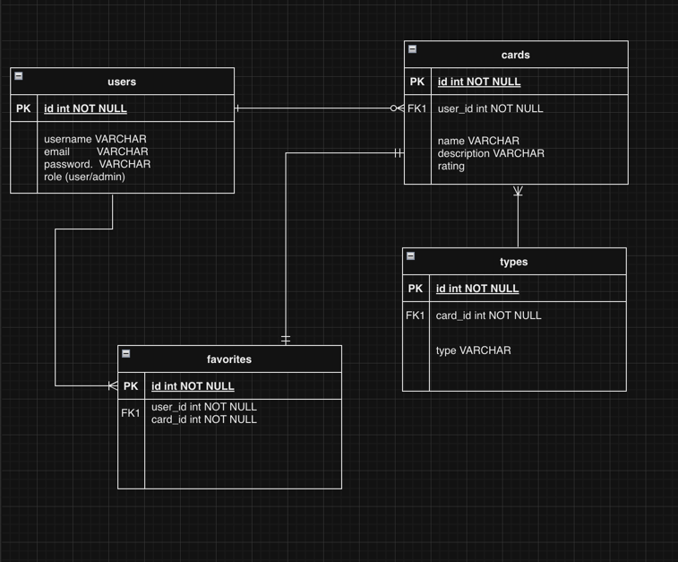
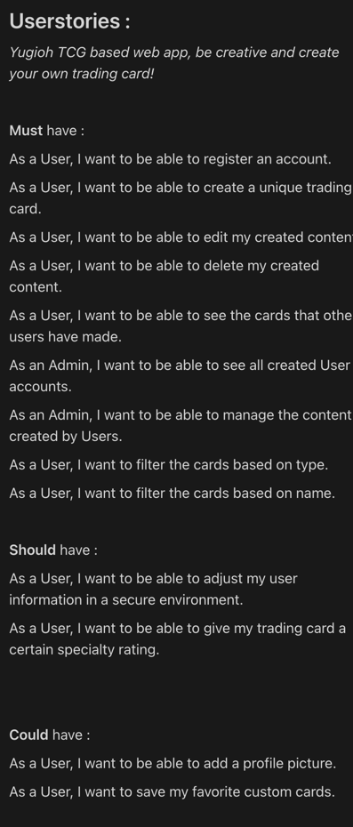

# 1/11/2024
* Add search function by input
* Cleaned up code 
* Added comments
* Add filter by category

# 31/10/2024
* Add : Model, View & Controller for Admin Role.
* Cleaned up code
* Add styling to admin homepage
* Add authentication to admin homepage
* Cleaned up code, added comments.
* Removed functions from routes.

# 24/10/2024
* Add : Working Tailwind
* Add : Working custom nav
* Add : Dynamic nav route login/logged out
* Add : Missing files
* Add : More styling
* Add : Drop down for card type selection

* Add : Styling layout
* Add : Correct Data presentation

# 21/10/2024
* Add : Comments
* Add : Routes to middleware
* Add : Code organisation
* Add : Styling
* Add : Middleware routes for authentication

# 17/10/2024
* Add : POST route
* Add : Title table
* Add : Add POST into table

# 15/10/2024
* Add : Migrations
* Add : Models
* Rendering data from database
* Add : index/show blade.php
* Add : Route to index.show for new models

# 14/10/2024 :

* ERD for the backend.
* 
* Userstories, MoScoW method.

# 10/10/2024 :
* Yugioh TCG 
* Add : ContactController
* Use : ContactController to pass parameters in Routes

# 10/10/2024 :
* Add : Changelog.md
* Add : _changelog directory

# 09/10/2024 : 
* Add : Local Repo & Github Repo

